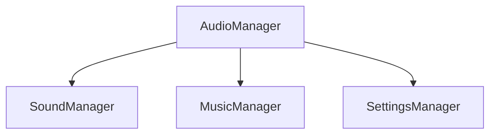
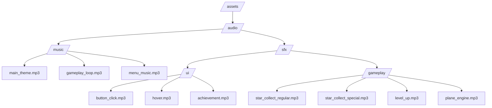

# Sky Squad: Audio Implementation Guide

This guide provides detailed instructions for implementing the audio system in the Sky Squad flight simulator, following Windsurf AI IDE Python development guidelines.

## Table of Contents

1. [Architecture Overview](#architecture-overview)
2. [Audio Asset Structure](#audio-asset-structure)
3. [Client-Side Implementation](#client-side-implementation)
4. [Server-Side Integration](#server-side-integration)
5. [Testing & Optimization](#testing--optimization)
6. [Accessibility Considerations](#accessibility-considerations)

## Architecture Overview

The Sky Squad audio system follows a component-based architecture that separates concerns and provides flexibility:



## Audio Asset Structure

Create the following directory structure for audio assets:



## Client-Side Implementation

### 1. Create the Audio Manager Class

Create a new file at `client/audio.js`:

```javascript
/**
 * Audio Manager for Sky Squad
 * Handles all game audio including music, sound effects and settings
 */
export class AudioManager {
  constructor() {
    // Initialize Web Audio API context
    this.audioContext = new (window.AudioContext || window.webkitAudioContext)();
    this.masterGainNode = this.audioContext.createGain();
    this.masterGainNode.connect(this.audioContext.destination);
    
    // Sound collections
    this.sounds = new Map();
    this.music = new Map();
    
    // State tracking
    this.currentMusic = null;
    this.isMuted = false;
    this.logger = this.setupLogger();
    
    // Volume settings (0.0 - 1.0)
    this.settings = {
      master: 0.8,
      music: 0.5,
      sfx: 0.7
    };
    
    // Create separate gain nodes for music and SFX
    this.musicGainNode = this.audioContext.createGain();
    this.sfxGainNode = this.audioContext.createGain();
    
    // Connect to master
    this.musicGainNode.connect(this.masterGainNode);
    this.sfxGainNode.connect(this.masterGainNode);
    
    // Apply initial volume settings
    this.updateVolumes();
  }
  
  /**
   * Set up JSON logging for audio system
   * @returns {Object} Logger object
   */
  setupLogger() {
    return {
      info: (message, data = {}) => {
        console.log(JSON.stringify({
          timestamp: new Date().toISOString(),
          level: 'INFO',
          component: 'AudioManager',
          message,
          ...data
        }));
      },
      error: (message, data = {}) => {
        console.error(JSON.stringify({
          timestamp: new Date().toISOString(),
          level: 'ERROR',
          component: 'AudioManager',
          message,
          ...data
        }));
      }
    };
  }
  
  /**
   * Update all volume levels based on settings
   */
  updateVolumes() {
    this.masterGainNode.gain.value = this.isMuted ? 0 : this.settings.master;
    this.musicGainNode.gain.value = this.settings.music;
    this.sfxGainNode.gain.value = this.settings.sfx;
  }
  
  /**
   * Set master volume
   * @param {number} value - Volume level (0.0 - 1.0)
   */
  setMasterVolume(value) {
    this.settings.master = Math.max(0, Math.min(1, value));
    this.updateVolumes();
    this.logger.info('Master volume changed', { volume: this.settings.master });
  }
  
  /**
   * Set music volume
   * @param {number} value - Volume level (0.0 - 1.0)
   */
  setMusicVolume(value) {
    this.settings.music = Math.max(0, Math.min(1, value));
    this.updateVolumes();
    this.logger.info('Music volume changed', { volume: this.settings.music });
  }
  
  /**
   * Set SFX volume
   * @param {number} value - Volume level (0.0 - 1.0)
   */
  setSfxVolume(value) {
    this.settings.sfx = Math.max(0, Math.min(1, value));
    this.updateVolumes();
    this.logger.info('SFX volume changed', { volume: this.settings.sfx });
  }
  
  /**
   * Toggle mute state
   * @returns {boolean} New mute state
   */
  toggleMute() {
    this.isMuted = !this.isMuted;
    this.updateVolumes();
    this.logger.info('Audio mute toggled', { muted: this.isMuted });
    return this.isMuted;
  }
  
  /**
   * Load a sound effect
   * @param {string} id - Unique identifier for the sound
   * @param {string} url - Path to sound file
   * @returns {Promise} Promise resolving when sound is loaded
   */
  async loadSound(id, url) {
    try {
      const response = await fetch(url);
      const arrayBuffer = await response.arrayBuffer();
      const audioBuffer = await this.audioContext.decodeAudioData(arrayBuffer);
      
      this.sounds.set(id, audioBuffer);
      this.logger.info('Sound loaded', { id, url });
      return true;
    } catch (error) {
      this.logger.error('Failed to load sound', { id, url, error: error.message });
      return false;
    }
  }
  
  /**
   * Load background music
   * @param {string} id - Unique identifier for the music
   * @param {string} url - Path to music file
   * @returns {Promise} Promise resolving when music is loaded
   */
  async loadMusic(id, url) {
    try {
      const response = await fetch(url);
      const arrayBuffer = await response.arrayBuffer();
      const audioBuffer = await this.audioContext.decodeAudioData(arrayBuffer);
      
      this.music.set(id, audioBuffer);
      this.logger.info('Music loaded', { id, url });
      return true;
    } catch (error) {
      this.logger.error('Failed to load music', { id, url, error: error.message });
      return false;
    }
  }
  
  /**
   * Play a sound effect
   * @param {string} id - ID of previously loaded sound
   * @param {Object} options - Playback options
   * @param {number} options.volume - Volume override (0.0 - 1.0)
   * @param {number} options.pitch - Pitch adjustment (0.5 - 2.0)
   * @param {boolean} options.loop - Whether to loop the sound
   * @returns {Object|null} Sound controller object or null if sound not found
   */
  playSound(id, options = {}) {
    const sound = this.sounds.get(id);
    if (!sound) {
      this.logger.error('Attempted to play unknown sound', { id });
      return null;
    }
    
    // Create source and gain nodes
    const sourceNode = this.audioContext.createBufferSource();
    sourceNode.buffer = sound;
    
    // Apply playback options
    sourceNode.loop = options.loop || false;
    if (options.pitch) {
      sourceNode.playbackRate.value = Math.max(0.5, Math.min(2, options.pitch));
    }
    
    // Create individual gain for this sound
    const gainNode = this.audioContext.createGain();
    if (options.volume !== undefined) {
      gainNode.gain.value = Math.max(0, Math.min(1, options.volume));
    }
    
    // Connect nodes: source -> sound gain -> sfx channel -> master
    sourceNode.connect(gainNode);
    gainNode.connect(this.sfxGainNode);
    
    // Start playback
    sourceNode.start();
    this.logger.info('Sound played', { id, options });
    
    // Return controller object
    return {
      stop: () => sourceNode.stop(),
      setVolume: (vol) => {
        gainNode.gain.value = Math.max(0, Math.min(1, vol));
      },
      setPitch: (rate) => {
        sourceNode.playbackRate.value = Math.max(0.5, Math.min(2, rate));
      }
    };
  }
  
  /**
   * Play background music
   * @param {string} id - ID of previously loaded music
   * @param {Object} options - Playback options
   * @param {boolean} options.loop - Whether to loop the music (default: true)
   * @param {number} options.fadeDuration - Fade in duration in seconds
   * @returns {Object|null} Music controller or null if music not found
   */
  playMusic(id, options = {}) {
    const music = this.music.get(id);
    if (!music) {
      this.logger.error('Attempted to play unknown music', { id });
      return null;
    }
    
    // Stop current music if playing
    if (this.currentMusic) {
      this.currentMusic.stop();
      this.currentMusic = null;
    }
    
    // Create source node
    const sourceNode = this.audioContext.createBufferSource();
    sourceNode.buffer = music;
    sourceNode.loop = options.loop !== false; // Loop by default
    
    // Create gain node for this specific music instance
    const gainNode = this.audioContext.createGain();
    
    // Apply fade-in if specified
    if (options.fadeDuration) {
      gainNode.gain.value = 0;
      gainNode.gain.linearRampToValueAtTime(
        1, 
        this.audioContext.currentTime + options.fadeDuration
      );
    }
    
    // Connect nodes: source -> music gain -> music channel -> master
    sourceNode.connect(gainNode);
    gainNode.connect(this.musicGainNode);
    
    // Start playback
    sourceNode.start();
    this.logger.info('Music started', { id, options });
    
    // Store reference to current music
    this.currentMusic = {
      id,
      sourceNode,
      gainNode,
      stop: (fadeOut = 0) => {
        if (fadeOut > 0) {
          gainNode.gain.linearRampToValueAtTime(0, this.audioContext.currentTime + fadeOut);
          setTimeout(() => sourceNode.stop(), fadeOut * 1000);
        } else {
          sourceNode.stop();
        }
        if (this.currentMusic && this.currentMusic.id === id) {
          this.currentMusic = null;
        }
      }
    };
    
    return this.currentMusic;
  }
  
  /**
   * Preload all required game audio assets
   * @returns {Promise} Promise resolving when all assets are loaded
   */
  async preloadAssets() {
    this.logger.info('Beginning audio preload');
    
    const soundPromises = [
      this.loadSound('ui_click', 'assets/audio/sfx/ui/button_click.mp3'),
      this.loadSound('ui_hover', 'assets/audio/sfx/ui/hover.mp3'),
      this.loadSound('achievement', 'assets/audio/sfx/ui/achievement.mp3'),
      this.loadSound('star_regular', 'assets/audio/sfx/gameplay/star_collect_regular.mp3'),
      this.loadSound('star_special', 'assets/audio/sfx/gameplay/star_collect_special.mp3'),
      this.loadSound('level_up', 'assets/audio/sfx/gameplay/level_up.mp3'),
      this.loadSound('plane_engine', 'assets/audio/sfx/gameplay/plane_engine.mp3')
    ];
    
    const musicPromises = [
      this.loadMusic('main_theme', 'assets/audio/music/main_theme.mp3'),
      this.loadMusic('gameplay', 'assets/audio/music/gameplay_loop.mp3'),
      this.loadMusic('menu', 'assets/audio/music/menu_music.mp3')
    ];
    
    try {
      await Promise.all([...soundPromises, ...musicPromises]);
      this.logger.info('Audio preload complete');
      return true;
    } catch (error) {
      this.logger.error('Audio preload failed', { error: error.message });
      return false;
    }
  }
  
  /**
   * Create a simple oscillator sound effect (useful for procedural audio)
   * @param {Object} options - Oscillator options
   * @param {string} options.type - Oscillator type (sine, square, sawtooth, triangle)
   * @param {number} options.frequency - Base frequency in Hz
   * @param {number} options.duration - Duration in seconds
   * @param {Object} options.envelope - ADSR envelope parameters
   * @returns {Promise} Promise that resolves when sound completes
   */
  playSynthSound(options) {
    const oscillator = this.audioContext.createOscillator();
    const gainNode = this.audioContext.createGain();
    
    // Set oscillator properties
    oscillator.type = options.type || 'sine';
    oscillator.frequency.value = options.frequency || 440;
    
    // Connect nodes
    oscillator.connect(gainNode);
    gainNode.connect(this.sfxGainNode);
    
    // Apply envelope
    const now = this.audioContext.currentTime;
    const env = options.envelope || { attack: 0.01, decay: 0.1, sustain: 0.5, release: 0.1 };
    const duration = options.duration || 0.5;
    
    // Start with zero gain
    gainNode.gain.setValueAtTime(0, now);
    
    // Attack phase
    gainNode.gain.linearRampToValueAtTime(1, now + env.attack);
    
    // Decay to sustain level
    gainNode.gain.linearRampToValueAtTime(env.sustain, now + env.attack + env.decay);
    
    // Release phase
    gainNode.gain.linearRampToValueAtTime(0, now + duration);
    
    // Start and stop oscillator
    oscillator.start(now);
    oscillator.stop(now + duration + 0.1); // Add small buffer for release
    
    // Return promise that resolves when sound is complete
    return new Promise(resolve => {
      setTimeout(resolve, (duration + 0.1) * 1000);
    });
  }
  
  /**
   * Generate a star collection sound effect with parameters based on star value
   * @param {number} value - Value/importance of the star (affects sound)
   */
  playStarCollectSound(value = 1) {
    // For important stars, play the pre-recorded special sound
    if (value >= 5) {
      return this.playSound('star_special');
    }
    
    // For regular stars, decide between pre-recorded or procedural sound
    // based on variety needs
    if (Math.random() < 0.7) {
      // Use pre-recorded sound with slight pitch variation
      return this.playSound('star_regular', {
        pitch: 0.9 + (Math.random() * 0.2) // 0.9-1.1 range for subtle variety
      });
    } else {
      // Generate procedural sound for more variety
      const baseFreq = 700 + (value * 100);
      return this.playSynthSound({
        type: 'sine',
        frequency: baseFreq,
        duration: 0.3,
        envelope: {
          attack: 0.01,
          decay: 0.1,
          sustain: 0.5,
          release: 0.2
        }
      });
    }
  }
}
```

### 2. Integrate Audio Manager with Main Game

Add the following to the beginning of `client/main.js`:

```javascript
import { AudioManager } from './audio.js';

// Global audio manager
let audioManager;

// Initialize audio system
async function initAudio() {
  audioManager = new AudioManager();
  await audioManager.preloadAssets();
  
  // Start menu music
  audioManager.playMusic('menu', { loop: true });
  
  // Add event listeners for UI sounds
  document.querySelectorAll('button').forEach(button => {
    button.addEventListener('click', () => audioManager.playSound('ui_click'));
    button.addEventListener('mouseenter', () => audioManager.playSound('ui_hover'));
  });
}
```

### 3. Update the Game Functions

Modify the existing functions to incorporate audio:

```javascript
// In startGame() function, after socket setup
function startGame(name) {
  username = name;
  socket = io('/ws');
  socket.on('state', (state) => {
    updateGame(state);
  });
  socket.emit('join', { username });
  initScene();
  document.getElementById('playerName').textContent = username;
  
  // Switch from menu music to gameplay music with crossfade
  audioManager.playMusic('gameplay', { 
    loop: true,
    fadeDuration: 2.0 
  });
}

// In playCollectSound() function, replace with:
function playCollectSound(starValue = 1) {
  audioManager.playStarCollectSound(starValue);
}

// In updateGame() function, modify star collection to include star value:
stars.forEach((star) => {
  if (isColliding(planePos, star, 0.5)) {
    socket.emit('collect_star', { type: 'collect_star', starId: star.id });
    playCollectSound(star.value || 1);
  }
});
```

### 4. Create Audio Settings UI

Add a settings menu to `client/index.html`:

```html
<div id="settings" class="settings-panel" style="display:none;">
  <h3>Settings</h3>
  <div class="setting">
    <label for="masterVolume">Master Volume</label>
    <input type="range" id="masterVolume" min="0" max="100" value="80">
    <span class="value">80%</span>
  </div>
  <div class="setting">
    <label for="musicVolume">Music Volume</label>
    <input type="range" id="musicVolume" min="0" max="100" value="50">
    <span class="value">50%</span>
  </div>
  <div class="setting">
    <label for="sfxVolume">Sound Effects</label>
    <input type="range" id="sfxVolume" min="0" max="100" value="70">
    <span class="value">70%</span>
  </div>
  <div class="setting">
    <label for="muteAudio">Mute All Audio</label>
    <input type="checkbox" id="muteAudio">
  </div>
  <button id="closeSettings">Close</button>
</div>

<!-- Add a settings button to the game UI -->
<div id="game" style="display:none;">
  <div id="score">Score: 0</div>
  <div id="playerName"></div>
  <button id="settingsButton" class="settings-button">⚙️</button>
  <canvas id="gameCanvas"></canvas>
</div>
```

Create `client/settings.js` to handle the settings UI:

```javascript
export function initSettingsUI(audioManager) {
  const settingsButton = document.getElementById('settingsButton');
  const settingsPanel = document.getElementById('settings');
  const closeButton = document.getElementById('closeSettings');
  
  // Sliders
  const masterSlider = document.getElementById('masterVolume');
  const musicSlider = document.getElementById('musicVolume');
  const sfxSlider = document.getElementById('sfxVolume');
  const muteCheckbox = document.getElementById('muteAudio');
  
  // Open settings panel
  settingsButton.addEventListener('click', () => {
    audioManager.playSound('ui_click');
    settingsPanel.style.display = 'block';
  });
  
  // Close settings panel
  closeButton.addEventListener('click', () => {
    audioManager.playSound('ui_click');
    settingsPanel.style.display = 'none';
  });
  
  // Master volume control
  masterSlider.addEventListener('input', () => {
    const value = parseInt(masterSlider.value) / 100;
    audioManager.setMasterVolume(value);
    updateSliderLabel(masterSlider);
  });
  
  // Music volume control
  musicSlider.addEventListener('input', () => {
    const value = parseInt(musicSlider.value) / 100;
    audioManager.setMusicVolume(value);
    updateSliderLabel(musicSlider);
    
    // Play a short music sample when adjusting
    if (Math.random() < 0.1) {
      audioManager.playSound('star_special');
    }
  });
  
  // SFX volume control
  sfxSlider.addEventListener('input', () => {
    const value = parseInt(sfxSlider.value) / 100;
    audioManager.setSfxVolume(value);
    updateSliderLabel(sfxSlider);
    
    // Play a sound when adjusting
    audioManager.playSound('ui_hover');
  });
  
  // Mute toggle
  muteCheckbox.addEventListener('change', () => {
    const isMuted = audioManager.toggleMute();
    muteCheckbox.checked = isMuted;
  });
  
  // Helper to update slider value displays
  function updateSliderLabel(slider) {
    const valueDisplay = slider.nextElementSibling;
    valueDisplay.textContent = `${slider.value}%`;
  }
  
  // Initialize labels
  updateSliderLabel(masterSlider);
  updateSliderLabel(musicSlider);
  updateSliderLabel(sfxSlider);
}
```

## Server-Side Integration

### 1. Add Star Value to Server Logic

Modify `server/main.py` to support star values:

```python
def generate_star():
    """Generate a new star with random position and value"""
    global stars, star_id_counter
    star_id_counter += 1
    
    # Randomly assign value - 10% chance of special star
    value = 5 if random.random() < 0.1 else 1
    
    star = {
        'id': f'star_{star_id_counter}',
        'x': random.uniform(-4.5, 4.5),
        'y': random.uniform(-4.5, 4.5),
        'value': value  # Add value property
    }
    stars.append(star)
    logger.info("Generated star", extra={
        "star_id": star['id'],
        "position": {"x": star['x'], "y": star['y']},
        "value": star['value']
    })
    return star
```

### 2. Update Score Calculation

Modify the collect_star function to account for star value:

```python
def collect_star(star_id):
    """Player collected a star"""
    global stars, score
    for i, star in enumerate(stars):
        if star['id'] == star_id:
            # Add star value to score instead of fixed 1 point
            score += star.get('value', 1)
            stars.pop(i)
            
            # Log star collection with structured data
            logger.info("Star collected", extra={
                "star_id": star_id,
                "value": star.get('value', 1),
                "new_score": score
            })
            
            # Generate a new star to replace the collected one
            generate_star()
            return True
    return False
```

## Testing & Optimization

### 1. Create Audio System Tests

Create `tests/frontend/audio.test.js`:

```javascript
import assert from 'node:assert/strict';
import { test } from 'node:test';
import { AudioManager } from '../../client/audio.js';

// Mock Web Audio API
global.AudioContext = class {
  constructor() {
    this.destination = {};
    this.currentTime = 0;
  }
  
  createGain() {
    return {
      connect: () => {},
      gain: { value: 1, linearRampToValueAtTime: () => {} }
    };
  }
  
  createOscillator() {
    return {
      connect: () => {},
      start: () => {},
      stop: () => {},
      frequency: { value: 440 }
    };
  }
  
  createBufferSource() {
    return {
      connect: () => {},
      start: () => {},
      stop: () => {},
      playbackRate: { value: 1 }
    };
  }
  
  decodeAudioData(buffer) {
    return Promise.resolve('audio-buffer');
  }
};

global.fetch = (url) => {
  return Promise.resolve({
    arrayBuffer: () => Promise.resolve(new ArrayBuffer(10))
  });
};

test('AudioManager initializes with correct settings', async () => {
  const audio = new AudioManager();
  assert.equal(audio.settings.master, 0.8);
  assert.equal(audio.settings.music, 0.5);
  assert.equal(audio.settings.sfx, 0.7);
  assert.equal(audio.isMuted, false);
});

test('Volume controls update settings correctly', async () => {
  const audio = new AudioManager();
  
  audio.setMasterVolume(0.6);
  assert.equal(audio.settings.master, 0.6);
  
  audio.setMusicVolume(0.3);
  assert.equal(audio.settings.music, 0.3);
  
  audio.setSfxVolume(0.4);
  assert.equal(audio.settings.sfx, 0.4);
  
  const muteResult = audio.toggleMute();
  assert.equal(muteResult, true);
  assert.equal(audio.isMuted, true);
});

test('Sound loading and playback functions correctly', async () => {
  const audio = new AudioManager();
  
  const loadResult = await audio.loadSound('test', 'fake/path.mp3');
  assert.equal(loadResult, true);
  assert.equal(audio.sounds.has('test'), true);
  
  const soundController = audio.playSound('test');
  assert.notEqual(soundController, null);
  assert.equal(typeof soundController.stop, 'function');
});
```

### 2. Performance Optimization

Add preloading and lazy initialization to the AudioManager:

```javascript
// In startGame() function
function startGame(name) {
  // ... existing code ...
  
  // Only initialize audio context after user interaction
  if (!audioManager) {
    initAudio().then(() => {
      audioManager.playMusic('gameplay', { loop: true });
    });
  } else {
    audioManager.playMusic('gameplay', { 
      loop: true,
      fadeDuration: 2.0 
    });
  }
}
```

## Accessibility Considerations

### 1. Visual Feedback for Audio Events

Add visual feedback for important audio events to support players with hearing impairments:

```javascript
// In updateGame function, add visual feedback when collecting stars
function updateGame(state) {
  // ... existing code ...
  
  stars.forEach((star) => {
    if (isColliding(planePos, star, 0.5)) {
      socket.emit('collect_star', { type: 'collect_star', starId: star.id });
      playCollectSound(star.value || 1);
      
      // Add visual feedback
      showVisualFeedback(star.value >= 5 ? 'special' : 'regular');
    }
  });
}

// Visual feedback function
function showVisualFeedback(type) {
  const feedback = document.createElement('div');
  feedback.className = `visual-feedback ${type}`;
  document.getElementById('game').appendChild(feedback);
  
  // Animate and remove
  setTimeout(() => {
    feedback.classList.add('animate');
    setTimeout(() => feedback.remove(), 1000);
  }, 0);
}
```

### 2. Configurable Audio Settings

Add additional accessibility settings:

```html
<div class="setting">
  <label for="visualFeedback">Enhanced Visual Feedback</label>
  <input type="checkbox" id="visualFeedback" checked>
</div>
```

---

## Implementation Timeline

| Day | Tasks |
|-----|-------|
| 1   | Set up basic AudioManager structure and sound loading |
| 2   | Create sound assets and implement core playback functions |
| 3   | Integrate with existing gameplay and add settings UI |
| 4   | Testing, optimization and accessibility features |

## Next Steps

1. Create or acquire the audio assets outlined in the asset structure
2. Implement the AudioManager class
3. Integrate with existing game code
4. Add settings UI and visual feedback
5. Test across different browsers and devices

---

*This document serves as the implementation guide for Task 8: Audio System Implementation*
