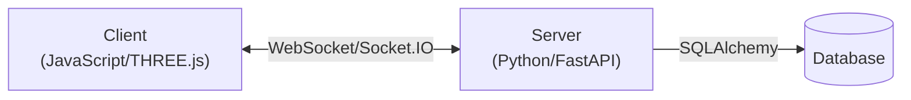

# Sky Squad: Technical Architecture Documentation

## System Architecture Overview

This document outlines the technical architecture of the Sky Squad flight simulator game, adhering to Windsurf AI IDE Python development guidelines.



## 1. Server-Side Architecture

### 1.1 Core Components

#### FastAPI Backend
- Entry point: `server/main.py`
- RESTful API endpoints for authentication, user management
- WebSocket integration for real-time game state

#### Socket.IO Integration
- Real-time bidirectional communication
- Event-based architecture for game events
- Connection management and state synchronization

#### Data Model
```python
# Database Models
User
  - id: Integer (Primary Key)
  - username: String
  - email: String
  - password: String (hashed)
  - created_at: DateTime
  - level: Integer
  - experience: Integer

PlayerStats
  - id: Integer (Primary Key)
  - user_id: Integer (Foreign Key)
  - stars_collected: Integer
  - time_played: Integer
  - highest_score: Integer

Achievement
  - id: Integer (Primary Key)
  - name: String
  - description: String
  
UserAchievement
  - id: Integer (Primary Key)
  - user_id: Integer (Foreign Key)
  - achievement_id: Integer (Foreign Key)
  - unlocked_at: DateTime
```

### 1.2 Key Services

#### Authentication Service
- JWT-based authentication
- Password hashing with bcrypt
- Session management

#### Game State Manager
- Star generation and management
- Player position tracking
- Collision detection
- Score calculation

#### Progression System
- Experience calculation
- Level progression
- Achievement tracking

### 1.3 Logging Implementation

Following Windsurf guidelines, all logging is implemented using Python's logging module with JSON formatting:

```python
import json
import logging
from datetime import datetime

class JSONFormatter(logging.Formatter):
    def format(self, record):
        log_record = {
            "timestamp": datetime.utcnow().isoformat(),
            "level": record.levelname,
            "message": record.getMessage(),
            "module": record.module,
            "function": record.funcName,
            "line": record.lineno
        }
        
        if hasattr(record, 'extra'):
            log_record.update(record.extra)
            
        if record.exc_info:
            log_record["exception"] = self.formatException(record.exc_info)
            
        return json.dumps(log_record)

def setup_logger():
    logger = logging.getLogger("sky_squad")
    handler = logging.StreamHandler()
    handler.setFormatter(JSONFormatter())
    logger.addHandler(handler)
    logger.setLevel(logging.INFO)
    return logger
```

## 2. Client-Side Architecture

### 2.1 Core Components

#### THREE.js Rendering Engine
- 3D scene management
- Camera controls
- Rendering optimization

#### Game Logic
- `client/main.js`: Core game loop and rendering
- `client/player.js`: Player movement and controls
- `client/stars.js`: Star generation and collection
- `client/audio.js`: Audio management

#### UI Components
- Login/registration form
- In-game HUD
- Achievement notifications
- Settings menu

### 2.2 Asset Management

- 3D models stored in `assets/models/`
- Textures stored in `assets/textures/`
- Audio files stored in `assets/audio/`
- Dynamic loading for performance optimization

## 3. Communication Protocol

### 3.1 WebSocket Events

| Event | Direction | Purpose | Payload |
|-------|-----------|---------|---------|
| `join` | Client → Server | Player joins game | `{ username: string }` |
| `state` | Server → Client | Game state update | `{ players: array, stars: array, score: int }` |
| `move` | Client → Server | Player movement | `{ type: "move", command: string }` |
| `collect_star` | Client → Server | Star collection | `{ type: "collect_star", starId: string }` |
| `achievement` | Server → Client | Achievement unlocked | `{ type: "achievement", id: int, name: string }` |

### 3.2 RESTful API Endpoints

| Endpoint | Method | Purpose | Authentication |
|----------|--------|---------|----------------|
| `/api/register` | POST | User registration | None |
| `/api/login` | POST | User authentication | None |
| `/api/profile` | GET | Get user profile | JWT |
| `/api/achievements` | GET | List achievements | JWT |
| `/api/leaderboard` | GET | Get leaderboard | Optional |

## 4. Testing Strategy

In accordance with Windsurf guidelines, we implement comprehensive testing:

### 4.1 Unit Testing

- Test individual components in isolation
- Use pytest for Python backend tests
- Jest for JavaScript frontend tests

```python
# Example test case format
def test_star_collection():
    """Test that stars are properly collected and scores updated"""
    # Arrange
    game_state = GameState()
    player_id = "test_player"
    star_id = "test_star"
    game_state.add_player(player_id, {"x": 0, "y": 0})
    game_state.add_star(star_id, {"x": 0, "y": 0})
    
    # Act
    result = game_state.collect_star(player_id, star_id)
    
    # Assert
    assert result is True
    assert game_state.get_player_score(player_id) == 1
    assert star_id not in game_state.stars
```

### 4.2 Integration Testing

- Test communication between components
- Focus on WebSocket communication
- Test database integrations

### 4.3 End-to-End Testing

- Simulate full user flows
- Test deployment in containerized environment
- Performance testing

### 4.4 Testing Environment

- Configured with environment variables
- Docker-based testing environment
- CI/CD integration

## 5. Deployment Architecture

### 5.1 Docker Containers

```yaml
# Structure of docker-compose.yml
services:
  web:
    build: .
    ports:
      - "8000:8000"
    environment:
      - DATABASE_URL=postgresql://user:password@db:5432/sky_squad
    depends_on:
      - db
  
  db:
    image: postgres:14
    volumes:
      - postgres_data:/var/lib/postgresql/data
    environment:
      - POSTGRES_PASSWORD=password
      - POSTGRES_USER=user
      - POSTGRES_DB=sky_squad
```

### 5.2 Infrastructure Requirements

- Minimum server specs: 2 vCPUs, 4GB RAM
- PostgreSQL database
- WebSocket capability
- Static file serving

## 6. Performance Considerations

### 6.1 Optimizations

- Client-side prediction for reduced latency
- Batched updates for WebSocket communication
- Asset preloading and caching
- Database query optimization

### 6.2 Monitoring

JSON-formatted logging for:
- Server performance metrics
- Connection statistics
- Error tracking
- User engagement metrics

## 7. Security Considerations

- HTTPS for all communications
- JWT token validation
- Input sanitization
- Rate limiting
- SQL injection prevention
- Content Security Policy

## 8. Future Technical Improvements

- WebRTC for peer-to-peer multiplayer
- WebGL 2.0 features for enhanced graphics
- Progressive Web App capabilities
- Voice chat integration
- Localization infrastructure

---

*This document is continuously updated as development progresses.*
