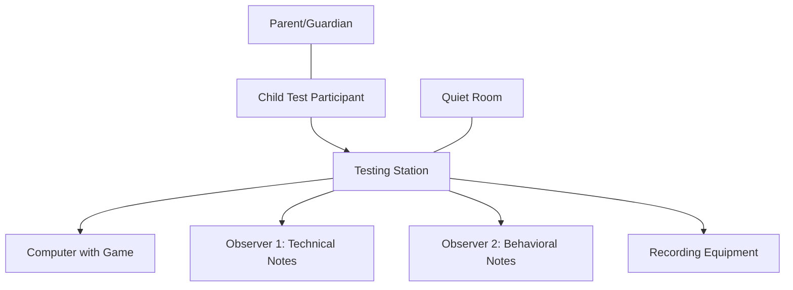

# Target Audience Usability Testing Guide
# Sky Squad Flight Simulator

## Overview
This document outlines the usability testing approach for Sky Squad Flight Simulator, specifically designed for children ages 6-12. The testing focuses on game enjoyment, ease of use, comprehension, and retention.

## Test Objectives
1. Validate that children can easily navigate and understand the game interface
2. Measure engagement and enjoyment levels
3. Assess comprehension of game objectives and mechanics
4. Evaluate difficulty levels for age-appropriateness
5. Test effectiveness of audio and visual feedback systems
6. Measure retention (how long children play without losing interest)

## Test Participant Requirements
- Children aged 6-12 years old
- Mix of genders
- Range of gaming experience levels
- Parental/guardian consent obtained
- Minimum 10 participants for statistically significant results

## Test Environment Setup


### Requirements:
- Quiet room with minimal distractions
- Computer with appropriate specifications
- Recording equipment (with parent/guardian permission)
- Note-taking materials for observers
- Seating for child, observers, and parent/guardian

## Testing Protocol

### Pre-Test (10 minutes)
1. Welcome child and parent/guardian
2. Explain the testing process using age-appropriate language
3. Collect basic information (age, gaming experience)
4. Ensure the child is comfortable

### Game Introduction (2 minutes)
1. Brief explanation of the game
2. No detailed instructions on controls or objectives (to test intuitiveness)

### Free Play Session (20 minutes)
1. Allow child to explore and play the game without intervention
2. Record time spent on each feature/area
3. Note questions asked, difficulties encountered
4. Measure time before first achievement

### Guided Tasks (15 minutes)
1. Collect a specific number of stars
2. Navigate through challenge points
3. Change settings (volume, controls)
4. Complete a level
5. View progression information

### Post-Test Interview (10 minutes)
Age-appropriate questions, such as:
1. "What did you like best about the game?"
2. "Was anything confusing or hard to understand?"
3. "What would make the game more fun?"
4. "Would you want to play this again?"
5. "On a scale of 1-5 smiley faces, how fun was this game?"

## Metrics to Measure

### Quantitative Metrics
- Time to first successful action
- Number of errors/incorrect attempts
- Time spent actively engaged
- Number of features discovered independently
- Completion rate of guided tasks
- Rating scores (using child-friendly scale)

### Qualitative Metrics
- Facial expressions and emotional reactions
- Verbalized confusion or delight
- Questions asked during play
- Descriptions of game elements in their own words
- Parent/guardian observations

## Observation Guidelines
```json
{
  "timestamp": "ISO timestamp",
  "level": "INFO",
  "component": "UsabilityTest",
  "participant_id": "Anonymous identifier",
  "age": "Participant age",
  "metric": "Observation category",
  "observation": "Detailed observation",
  "emotional_state": "Engaged/Confused/Frustrated/Delighted/Bored"
}
```

### Focus Areas:
1. **Onboarding Experience**:
   - Does the child understand how to start?
   - How quickly do they grasp basic controls?

2. **Audio Feedback**:
   - Reactions to sound effects and music
   - Do audio cues help guide actions?

3. **Visual Elements**:
   - Ability to find and interpret UI elements
   - Reactions to visual feedback

4. **Progression System**:
   - Understanding of leveling and achievements
   - Motivation from rewards

5. **Cognitive Load**:
   - Signs of confusion or overwhelm
   - Need for repeated explanations

## Adjustments for Different Ages
- **Ages 6-7**: More observer assistance, simpler questions
- **Ages 8-9**: Medium complexity tasks, some assistance
- **Ages 10-12**: More complex challenges, minimal assistance

## Analysis Method
Data will be analyzed to identify:
- Common pain points or confusion areas
- Features that generate most engagement
- Age-specific patterns of interaction
- Recommendations for improvements

## Testing Schedule
1. Initial testing with 5 participants
2. Implement high-priority adjustments
3. Second round with 5 new participants
4. Final adjustments before release

## Ethics and Safety
- Obtain written parental consent
- Explain that testing can stop at any time
- No identifiable information stored
- Comfortable environment with breaks offered
- Parent/guardian present throughout testing

## Reporting Template
Results will be formatted as:
```
# Usability Test Results

## Executive Summary
[Brief overview of findings]

## Key Metrics
- Average engagement time: [x] minutes
- Task completion rate: [x]%
- Enjoyment rating: [x]/5
- Would play again: [x]%

## Age-Specific Findings
[Breakdown by age groups]

## Recommendations
[Prioritized list of adjustments]

## Conclusion
[Overall assessment of child-friendliness]
```

## Implementation Checklist
- [ ] Recruitment materials prepared
- [ ] Testing environment configured
- [ ] Observation templates ready
- [ ] Recording equipment tested
- [ ] Post-test reward items for participants
- [ ] Analysis framework prepared
